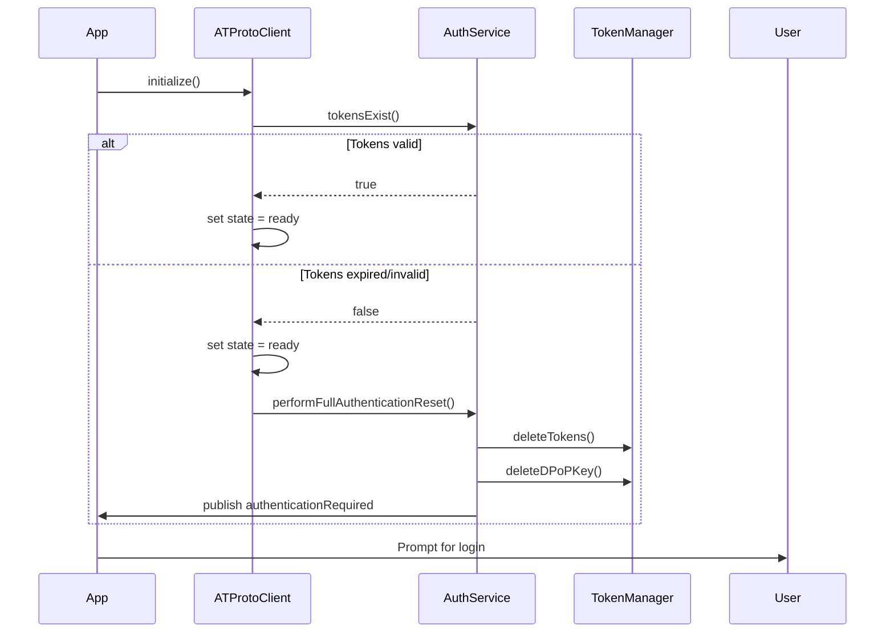

# Robust Expired Token Handling & Initialization Recovery Plan

## Problem Recap

- **Current flow:**  
  - During initialization, if tokens are expired, the app sets itself to “unauthenticated” before finishing initialization, and ignores clearing the client.
  - This leaves the app in a broken state where it cannot recover without a full reset.

- **Goal:**  
  - Ensure that expired tokens during initialization trigger a controlled logout/reset that clears only authentication state, not all account data.
  - Initialization should always complete, even if tokens are expired, so the client can recover and prompt for login.

---

## Proposed Solution

### 1. Initialization Sequence

- **Always complete initialization** (set state to `.ready`), even if tokens are expired or missing.
- If tokens are expired, trigger a controlled logout/reset after initialization, not during.

### 2. Error Recovery

- **If token refresh fails with a permanent error (e.g., invalid/expired refresh token):**
  - Call a method like `performFullAuthenticationReset()` that:
    - Deletes tokens and DPoP keys for the current DID.
    - Leaves other account data (e.g., handles, PDS URLs) intact.
    - Publishes `.authenticationRequired` so the UI can prompt for login.

### 3. Client Clear Logic

- **Replace “ignoring client clear” logic:**
  - If initialization is not complete, still clear tokens and DPoP keys, but don’t attempt client operations.
  - If initialization is complete, perform a full client clear.

### 4. State Separation

- **Separate these states:**
  - Initialization state (is the client ready to accept commands?)
  - Authentication state (is the user authenticated?)
  - Token validity (are tokens valid/expired?)

---

## Sequence Diagram

---

## Implementation Plan

1. **ATProtoClient Initialization**
    - Always set `initState = .ready` at the end of initialization, even if tokens are expired.
    - If tokens are expired or refresh fails with `.invalidGrant`, call `performFullAuthenticationReset()` and publish `.authenticationRequired`.

2. **AuthenticationService**
    - Implement `performFullAuthenticationReset()` to:
        - Delete tokens for the current DID.
        - Delete DPoP key for the current DID.
        - Publish `.authenticationRequired`.

3. **Client Clear Logic**
    - In logout/reset flows, always clear tokens and DPoP keys, even if initialization is not complete.

4. **Testing**
    - Simulate expired tokens and verify:
        - Initialization completes.
        - App prompts for login.
        - No full data nuke occurs.

---

## Summary

This plan ensures robust recovery from expired tokens, always completes initialization, and avoids unnecessary data loss. The architecture separates initialization, authentication, and token validity for maintainable and predictable behavior.